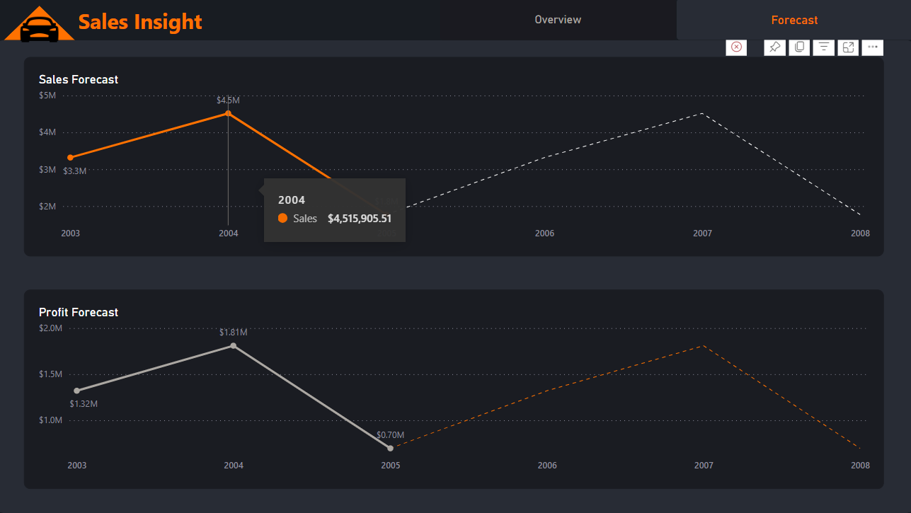

# Axon Sales Data Management and Analysis Project

## Problem Statement

Axon, a retailer selling classic cars, faces challenges in managing and analyzing sales data. The sales team lacks a centralized system for data management and struggles to derive insights. Consequently, accurate and up-to-date sales reports are unavailable, hampering decision-making.

To address this, Axon has decided to implement a Business Intelligence (BI) solution using PowerBI and SQL. The project aims to:

- Import and integrate data from MySQL into PowerBI.
- Clean and transform data for analysis.
- Build interactive dashboards and reports for the sales team and management.
- Utilize SQL for advanced analytics and insights extraction.
- Enable real-time access to dashboards for data-driven decision-making.

## Solution Overview

The BI solution comprises two pages: Overview and Forecast.

### Overview Page

The Overview page includes:

- Four visualizations:
  1. Sales by month
  2. Sales by product lines
  3. Sales by year and region
  4. Top products by sales

- A bookmark toggling visibility between:
  - Profit-related visualizations:
    1. Profit by month
    2. Profit by product lines
    3. Profit by year and region
    4. Top products by profit

- Year, quarter, and month filters.
- Page navigation.
- Dynamic cards displaying sales, profit, profit margin, and units sold.

### Forecast Page

The Forecast page displays:

- Sales forecast visualization.
- Profit forecast visualization.

PowerBI's built-in forecasting feature is utilized for generating forecasts.

## Screenshots

## Access Dashboard

Access the dashboard [here](https://app.powerbi.com/view?r=eyJrIjoiZDhmZTUwNDgtZjE1NS00NzlmLTk4OGYtNWZkY2Y0NGNiZWEwIiwidCI6ImM2ZTU0OWIzLTVmNDUtNDAzMi1hYWU5LWQ0MjQ0ZGM1YjJjNCJ9&pageName=ReportSection88c363680d1324008e55).

## Contact

For bug reporting or queries, connect on [LinkedIn](https://www.linkedin.com/in/pratheekpshenoy/).
